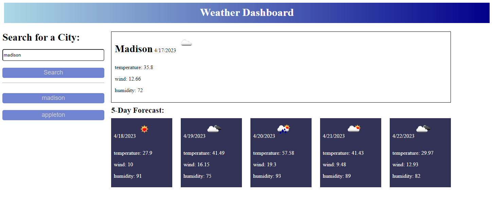

# weather-dashboard

Weather dashboard that shows the current weather for city searched and the 5-day forecast.

## Technologies Used

- HTML
- CSS
- JavaScript

## Descriptions

The weather dashboard displays the current weather and the 5-day forecast for the city searched. A button for each city searched will be created so the user can go back to a previous city searched to get the weather.

## Visual

## Installation

1. Create index.html, style.css, and script.js files.
2. Get a API Key from: https://openweathermap.org/forecast5 
3. Create a variable for the API Key in the script.js file.
## Deployed Link
https://adorahtho.github.io/weather-dashboard/

## Author & Acknowledgements

- @thoak90codes
- UW Coding Bootcamp
